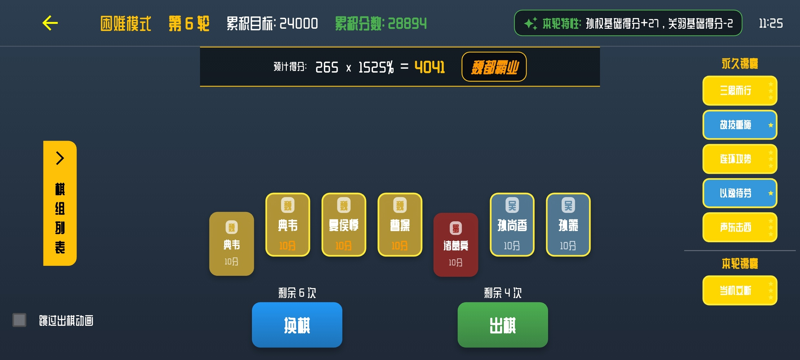

# 文字版“三分英雄棋”小游戏

王者荣耀小游戏“三分英雄棋”的“无尽挑战”模式的简单文字版。

- 通过选择不同阵营的英雄棋子，结合轮次特性，触发各种羁绊和锦囊效果，获取高分以通过关卡。

支持 Web、移动端和桌面端。

- 设计分辨率为 960x540；移动端默认强制横屏显示

努比亚 Z60Ultra 截图：



## 游戏流程

1. 开始游戏后显示轮次特性
2. 选择锦囊（前 5 轮选择的锦囊永久生效，第 6 轮及其之后选择锦囊仅当轮有效）
3. 进入游戏主界面，选择棋子进行出棋或换棋
4. 达到目标分数后进入下一轮，否则游戏结束

## 主要技术栈

- Flutter 框架
- Flame 游戏引擎
- Provider 状态管理
- SharedPreferences 数据存储

## 开发与运行

确保已安装 Flutter 开发环境，然后执行：

```bash
flutter pub get
flutter run
```

## 注意事项

- 不知道原版是怎样实现的，所以很多地方不完全一样，比如：
  - 随机补充棋子的逻辑、轮次特性的逻辑、等
  - 动画、特效什么的也就别想了
  - 少量没见过的锦囊的数值为估计值，其它是有确认过：
    - 一级的“以逸待劳”，估计为`75%`
    - 一级的“当机立断”，估计为`30`
    - 一级的“深根固本”，估计为`50%`
    - 三级的“故技重施”，估计为`125`
    - 三级的“短兵相接”，估计为`300%`
- 新加的难度选择，困难是和原版一样的计算方式，但是想要得分比原版更困难，所以加了简单和中等难度
- **代码中有完成播放 BGM 和少量操作音效的功能**，但是没有去找合适的音频所以没有启用。
  - 如有需要，可以自行替换`assets/audio`同名音频，并取消 [welcome_screen.dart](lib/screens/welcome_screen.dart) 的注释即可。
- 有简单测试使用`站酷庆科黄油体`字体作为游戏字体进行测试
  - 有尝试简单使用其他字体，但是“惇”字很多都不兼容
  - 如果不喜欢可以自行在[main.dart)](lib/main.dart)注释掉，使用默认字体

## 三种模式得分计算

- 新加的两种模式(可以无限畅玩下去，难度在于游玩时间，因为游戏没有暂停恢复)：

\[
\text{简单模式得分} = 800n^2 - 1250n + 1050
\]

\[
\text{中等模式得分} = 35n^3 + 350n^2 - 300n + 900
\]

- 原版的计算方式（全服最高 160 多万，而这个文字版还没有原版那么灵活，想得高分更困难）：

\[
\text{困难模式得分} = 50n^3 + 400n^2 - 350n + 900
\]

<details>

<summary>得分计算结果对比表</summary>

| n   | easy    | medium  | hard    |
| --- | ------- | ------- | ------- |
| 1   | 600     | 985     | 1000    |
| 2   | 1750    | 1980    | 2200    |
| 3   | 4500    | 4095    | 4800    |
| 4   | 8850    | 7540    | 9100    |
| 5   | 14800   | 12525   | 15400   |
| 6   | 22350   | 19260   | 24000   |
| 7   | 31500   | 27955   | 35200   |
| 8   | 42250   | 38820   | 49300   |
| 9   | 54600   | 52065   | 66600   |
| 10  | 68550   | 67900   | 87400   |
| 11  | 84100   | 86535   | 112000  |
| 12  | 101250  | 108180  | 140700  |
| 13  | 120000  | 133045  | 173800  |
| 14  | 140350  | 161340  | 211600  |
| 15  | 162300  | 193275  | 254400  |
| 16  | 185850  | 229060  | 302500  |
| 17  | 211000  | 268905  | 356200  |
| 18  | 237750  | 313020  | 415800  |
| 19  | 266100  | 361615  | 481600  |
| 20  | 296050  | 414900  | 553900  |
| 21  | 327600  | 473085  | 633000  |
| 22  | 360750  | 536380  | 719200  |
| 23  | 395500  | 604995  | 812800  |
| 24  | 431850  | 679140  | 914100  |
| 25  | 469800  | 759025  | 1023400 |
| 26  | 509350  | 844860  | 1141000 |
| 27  | 550500  | 936855  | 1267200 |
| 28  | 593250  | 1035220 | 1402300 |
| 29  | 637600  | 1140165 | 1546600 |
| 30  | 683550  | 1251900 | 1700400 |
| 31  | 731100  | 1370635 | 1864000 |
| 32  | 780250  | 1496580 | 2037700 |
| 33  | 831000  | 1629945 | 2221800 |
| 34  | 883350  | 1770940 | 2416600 |
| 35  | 937300  | 1919775 | 2622400 |
| 36  | 992850  | 2076660 | 2839500 |
| 37  | 1050000 | 2241805 | 3068200 |
| 38  | 1108750 | 2415420 | 3308800 |
| 39  | 1169100 | 2597715 | 3561600 |
| 40  | 1231050 | 2788900 | 3826900 |
| 41  | 1294600 | 2989185 | 4105000 |
| 42  | 1359750 | 3198780 | 4396200 |
| 43  | 1426500 | 3417895 | 4700800 |
| 44  | 1494850 | 3646740 | 5019100 |
| 45  | 1564800 | 3885525 | 5351400 |
| 46  | 1636350 | 4134460 | 5698000 |
| 47  | 1709500 | 4393755 | 6059200 |
| 48  | 1784250 | 4663620 | 6435300 |
| 49  | 1860600 | 4944265 | 6826600 |
| 50  | 1938550 | 5235900 | 7233400 |

</details>
